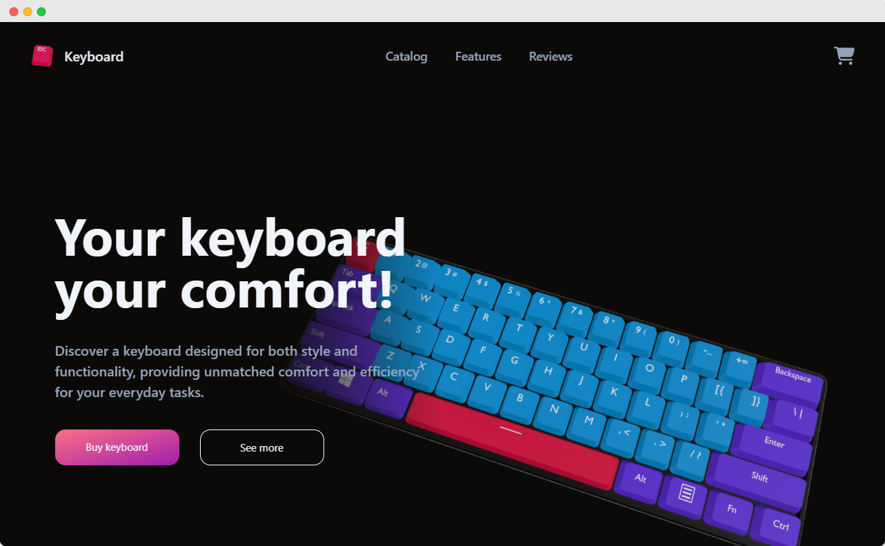

# 3D Shop

[](https://nextjs.org/) 
[](https://reactjs.org/)
[](https://www.typescriptlang.org/)
[](https://tailwindcss.com/)
[](https://threejs.org/)
[](https://react-spring.io/)
[](https://www.framer.com/motion/)

---

## Sobre o Projeto

3D Shop é uma aplicação web moderna para exibir e vender teclados mecânicos com visualização interativa.  
Construída com Next.js 14, React e TypeScript, utiliza Three.js para renderização 3D e Tailwind CSS para design responsivo e moderno.



---

## Funcionalidades Principais

- Catálogo de produtos com imagens e modelos 3D interativos
- Visualização 3D dos produtos com rotação via mouse e toque
- Carrinho de compras com controle de quantidade e checkout via API
- Animações suaves com React Spring e Framer Motion
- Layout responsivo e estilizado com Tailwind CSS
- Seções de reviews, promoções e recursos do produto

---

## Tecnologias Utilizadas

- **Next.js 14** – framework React para SSR, roteamento e API
- **React** – construção da interface declarativa
- **TypeScript** – tipagem estática para maior robustez
- **Three.js** – renderização 3D e carregamento de modelos GLB
- **React Spring** – animações físicas e fluidas
- **Framer Motion** – animações UI suaves e controle de visibilidade
- **Tailwind CSS** – framework CSS utilitário para design rápido
- **React Hot Toast** – notificações interativas para o usuário

---

## Como Rodar Localmente

1. Clone o repositório:
   ```bash
   git clone https://github.com/seu-usuario/3d_shop.git
   ```

2. Instale as dependências:
   ```bash
   npm install
   # ou
   yarn install
   ```

3. Rode o servidor de desenvolvimento:
   ```bash
   npm run dev
   # ou
   yarn dev
   ```

4. Acesse `http://localhost:3000` no navegador.

---

## Estrutura do Projeto

- `app/` – rotas, layout, fontes e arquivos globais
- `components/` – componentes React divididos em `sections` e `ui`
- `contexts/` – contextos para estado global (ex: Carrinho)
- `hooks/` – hooks customizados
- `public/assets/` – imagens, modelos 3D e outros recursos estáticos
- Configurações e scripts: `next.config.ts`, `tailwind.config.ts`, `postcss.config.js`

---

## Aviso de Direitos Autorais

Este projeto é baseado no repositório original [Fibipals/3d_shop](https://github.com/Fibipals/3d_shop).  
Agradecemos ao autor original pelo código e inspiração.

**Por favor, respeite as licenças originais e não copie este projeto integralmente para fins comerciais sem a devida autorização.**  
Este código é para aprendizado, referência e uso pessoal. Qualquer uso indevido é de responsabilidade do usuário.

---

## Contato

Se tiver dúvidas ou quiser contribuir, abra uma issue ou pull request no repositório.

---

Feito com ❤️ por Gustavo Almeida
